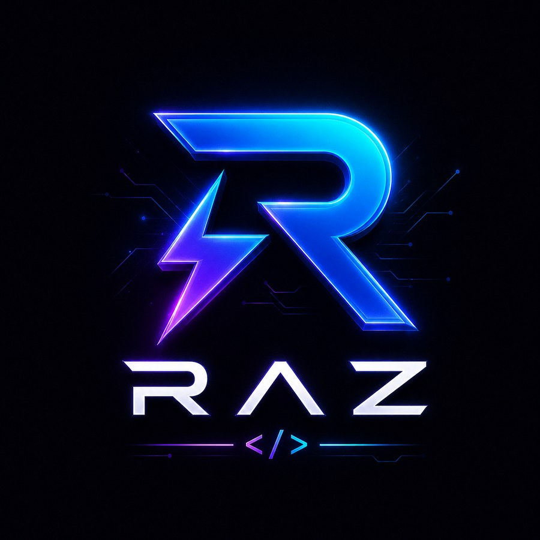

<div align="center">



# Raz

**A modern systems programming language for fast, reliable native software.**

[](https://github.com/raz-language/raz)
[](https://github.com/raz-language/packages)
[](https://github.com/raz-language/raz)

</div>

---

## The Raz language

Raz is a general-purpose systems programming language designed around three priorities:

**performance, safety, and control.**

The project is building a complete native development platform: a self-hosted compiler, high-performance runtime and standard library, package management, WebAssembly support, native executable targets, diagnostics, formatter, and developer tooling.

Raz is intended for software where runtime cost, memory behavior, concurrency, and machine-level control matter — without giving up modern language design.

### Design goals

- **Native performance** with predictable execution and low runtime overhead.
- **Strong static guarantees** through compile-time analysis and ownership-aware semantics.
- **Systems-level control** for runtimes, compilers, networking, infrastructure, and performance-critical applications.
- **Modern abstractions** including generics, traits, pattern matching, structured types, and expressive error handling.
- **First-class tooling** built as part of the language rather than as an afterthought.
- **Portable targets** with native Windows and Linux support and an evolving WebAssembly backend.
- **A cohesive ecosystem** centered on the `raz` toolchain and the official package registry.

---

## Example

```raz
struct Point {
    x: f64,
    y: f64,
}

fn distance(a: Point, b: Point) -> f64 {
    let dx = b.x - a.x;
    let dy = b.y - a.y;

    sqrt(dx * dx + dy * dy)
}

fn main() {
    let a = Point { x: 0.0, y: 0.0 };
    let b = Point { x: 3.0, y: 4.0 };

    println("distance = {}", distance(a, b));
}
```

> Raz is under active development. Syntax, tooling, and implementation details may continue to evolve until stable language releases are published.

---

## Repositories

| Repository | Purpose |
|---|---|
| **[`raz-language/raz`](https://github.com/raz-language/raz)** | Compiler, language implementation, runtime, standard library, backends, and core developer tools. |
| **[`raz-language/packages`](https://github.com/raz-language/packages)** | Official Raz package registry and package index. |

---

## Toolchain

The Raz command-line experience is designed to stay small and consistent:

```text
raz build      Build a project
raz run        Build and run a project
raz check      Type-check and validate without producing a final binary
raz test       Run project tests
raz fmt        Format Raz source
raz package    Work with packages and manifests
```

The exact command set may evolve as the toolchain reaches stable releases.

---

## Architecture

The compiler is moving toward a Raz-owned implementation, with native code retained only where it belongs: platform, ABI, runtime, and backend boundaries.

At a high level:

```text
Raz source
    │
    ▼
Parser / AST
    │
    ▼
Semantic analysis
    │
    ▼
HIR / MIR
    │
    ├──────────────► diagnostics / tooling
    │
    ▼
Backend
    │
    ├──────────────► native targets
    ├──────────────► WebAssembly
    └──────────────► Raz runtime/executable targets
```

The language and toolchain are being developed as one system rather than a collection of disconnected tools.

---

## Project direction

Current work is focused on the pieces required for a production-capable language ecosystem:

- compiler correctness and self-hosting
- ownership and borrow checking
- traits and generics
- pattern matching
- MIR semantics and optimization
- native code generation
- WebAssembly
- package management
- standard library coverage
- formatter and diagnostics
- editor and IDE integration
- reproducible builds and testing

Project documentation is kept focused on durable architecture, language behavior, usage, and developer reference. Development history belongs in changelogs, release notes, and internal engineering notes.

---

## Contributing

Raz is an open-source project and contributions are welcome.

Before opening a pull request, please review the repository's contribution guidelines and keep changes focused, testable, and consistent with the project's architecture.

For bugs and feature proposals, use the issue templates provided by the organization.

---

## Security

Please do not report security vulnerabilities through public issues.

See [`SECURITY.md`](../SECURITY.md) in this organization repository for the current reporting policy.

---

<div align="center">

**Raz — fast by design.**

[Compiler](https://github.com/raz-language/raz) ·
[Packages](https://github.com/raz-language/packages)

</div>
